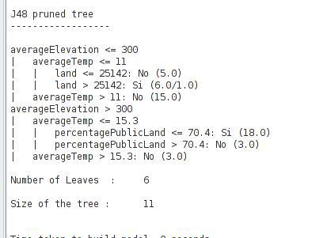
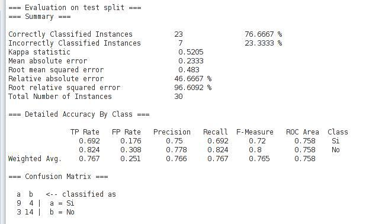

## Datos obtenidos

Al abrir el fichero __table.arff__ con el weka, se selecciona el algoritmo __J48__ y con:
- un porcentaje de partición (Percentage split) de 40 % (se entrena con los 20 primeros estados y valida
con los 30 últimos, se obtienen los siguientes:

## Árbol resultante

## Precisión

